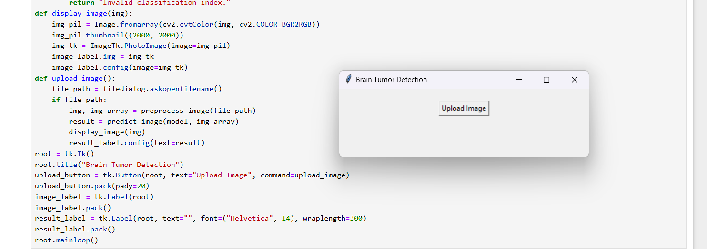
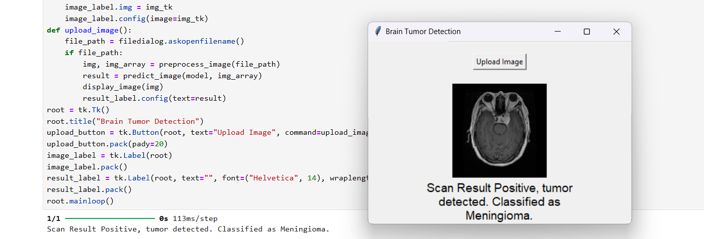
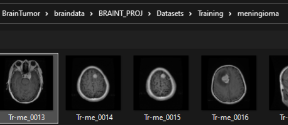

# 🧠 **Detection and Classification of Brain Tumor using CNN**  

## 📜 **Description**
Prompt and early detection of brain tumors is a rapidly growing research field in **medical imaging** and **machine learning**. Leveraging **Convolutional Neural Networks (CNN)**, this project aims to classify tumors with a high degree of accuracy, providing early treatment opportunities, saving lives, and contributing to societal welfare.This project was completed by me earlier this year.

---

## 📂 **Dataset**
You can download the dataset from [Kaggle](https://www.kaggle.com/datasets/masoudnickparvar/brain-tumor-mri-dataset).

### 🔍 **What is the Dataset?**
- **Size:** ~7023 MRI images of the human brain  
- **Classes:**  
  - **Glioma**  
  - **Meningioma**  
  - **No Tumor**  
  - **Pituitary**  
- **Description:**  
  A brain tumor is a collection or mass of abnormal cells in the brain. Due to the rigidity of the skull, any growth can cause severe issues, potentially leading to brain damage or becoming life-threatening. Tumors can be **malignant (cancerous)** or **benign (non-cancerous)**.  
- **Storage Requirement:** ~160-170 MB  

---

## 🛠️ **Approach**
1. **Understand the Dataset:** Analyze the dataset and decide how to split it.  
2. **Preprocessing:** Visualize sample images to ensure the images are being read properly.  
3. **Model Development:**  
   - Design a CNN architecture.  
   - Train the model for **150-200+ epochs** to ensure sufficient learning.  
4. **Evaluation:** Achieve acceptable accuracy.  
5. **Innovation:**  
   - Add a GUI for tumor detection using **Tkinter**(my approach).  
   - I plan to enhance with a frontend for a globally accessible interface.  

---

## 🧩 **What Do You Need?**
- 💻 **Knowledge:**  
  - **Python** and libraries like TensorFlow/Keras  
  - Concepts of **CNN**, such as MaxPooling, Dropout, and Dense Layers  
- 🧠 **Understanding:**  
  - Proper **train-test split** strategies (e.g., **75-80% Training, 10% Testing, 10% Validation**)  
  - Fine-tuning models for higher accuracy and better results  

---

## 🎯 **Why I Chose This Project?**
Cancer is a growing challenge affecting millions worldwide, impacting our loved ones and society as a whole. I wanted to contribute to technological progress and **resilience against cancer**. Early detection dramatically improves survival rates. By working on this project, I aim to make a meaningful impact in the fight against cancer.  

---  

### 🚀 **Future Plans**
- Develop a user-friendly **frontend** for global accessibility  
- Incorporate advanced CNN techniques for even better performance  

---
## 📸 **Project Snippets**

Here are some snippets showcasing the project:

| **Image 1** | **Image 2** | **Image 3** |
|---------------------|---------------------|---------------------|
|  |  |  |

---

🌟 **Let’s detect, classify, and save lives! :)**
